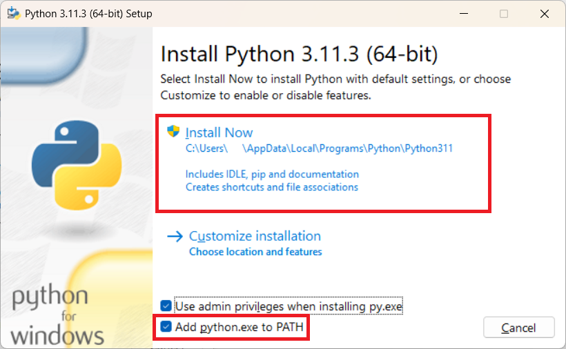

# Grubway

A cross-platform PoS application written for Grubway.

Table of Contents:
1. [Requirements](#requirements)
   1. [Installing Python Tip (Windows Only)](#installing-python-tip-windows-only)
   1. [Installing Python for macOS](#installing-python-for-macos)
   1. [Verifying Python Works](#verifying-python-works)
1. [How to Build](#how-to-build)
   1. [From Qt Creator](#from-qt-creator)
   1. [From the Terminal](#from-the-terminal)
1. [Common Issues](#common-issues)
   1. [Unable to launch 'pip', please make sure the program is installed and located in your system PATH.](#unable-to-launch-pip-please-make-sure-the-program-is-installed-and-located-in-your-system-path)
   1. [Package 'flask' is not installed. Please make sure you install flask. You can install flask with 'pip install flask'.](#package-flask-is-not-installed-please-make-sure-you-install-flask-you-can-install-flask-with-pip-install-flask)

## Requirements

This project requires:
* Qt 5.15 or higher
* Python 3.9 or higher (installed to PATH in Windows, see the [tip](#installing-python-tip-windows-only) for more information.

This application includes a script that requires some dependencies in Python to be installed.

To install the dependency, simply execute:
```
pip install -r requirements.txt
```

### Installing Python Tip (Windows only)

Python should be installed via the 64-bit Setup EXE from https://www.python.org, not from the Microsoft Store. When installing on Windows, be sure to tick the button "Add to PATH" before installing, this will ensure that the project is built properly.




### Installing Python for macOS

Python should be installed from the latest Python installer from https://www.python.org, not from Homebrew or any other package manager. The install will be stored at /Library/Frameworks/Python.framework

Per Python.org - https://docs.python.org/3/using/mac.html
 
The Apple-provided build of Python is installed in /System/Library/Frameworks/Python.framework and /usr/bin/python, respectively. You should never modify or delete these, as they are Apple-controlled and are used by Apple- or third-party software. Remember that if you choose to install a newer Python version from python.org, you will have two different but functional Python installations on your computer, so it will be important that your paths and usages are consistent with what you want to do.


Additionally you will want to create aliases for python and pip as by default they are accessed via python3 and pip3.
To do this open up your zsh or bash profile at `~/.zshrc` or `~/.bash_profile` depending on what shell you are using. 

You can open it up directly from the terminal via the command: 
`open -e ~/.zshrc.` 

Then add the following:

```
export PATH="/Library/Frameworks/Python.framework/Versions/3.11/bin:$PATH"
alias python="python3"
alias pip="pip3"
```

Then save and close. 

### Verifying Python Works

You should be able to run Python in your system's terminal after installation. Open a new terminal from your system (WinKey+R and `cmd.exe` for Windows, launch 'Terminal' in macOS, and CTRL+ALT+T on desktops in Linux). Execute the below command:

```
pip --version
```

This will echo your `pip` version that you have installed. macOS and Linux users should already have this in their path, Windows users must read the above article to ensure their instance of Python is set up properly.

## How to Build

This section will explain how to build and run the application from either an IDE or the command line terminal. If you run into issues, please see the common issues section [below](#common-issues).

### From Qt Creator

Open the `Grubway.pro` file and click the Run button.

### From the Terminal

Open the terminal. Ensure the applications `qmake` and `make` are in the path (Windows users have to use `mingw32-make.exe`).

CHDIR into the same location as `Grubway.pro`. Run `qmake` to generate the Makefile, and execute `make`.

A program named `Grubway.exe` will output into the same directory as the PRO file.

## Common Issues

### Unable to launch 'pip', please make sure the program is installed and located in your system PATH.

This issue stems from the application's inability to run the application `pip`. This can be due to a number of issues, such as Python not being installed, it is not in the system `PATH`, or (worst comes to worst) the actual application is broken.

To test that `pip` is working properly you will want to run `pip` in a terminal window, as it is a command-line interface (CLI) application.

* On Windows, you can press WinKey + R and type `cmd.exe` in the Run box, and run the below command to test that `pip` is working. If you get a 'command not found' error, please see [here](#verifying-python-works) to verify you are installing Python properly.
* On MacOS or Linux, you want to get to your system's terminal and execute the below command. It should echo back the version of `pip` you have installed.

The command to run with `pip` is:
```
pip --version
```

### Package 'flask' is not installed. Please make sure you install flask. You can install flask with 'pip install flask'.

This issue stems from the package `Flask` not being found as a module within your Python installation.

You can solve this issue by simply executing the following line below:

```
pip install flask
```

If you are using more than one version of Python on Windows or macOS, verify that your System Environment variables for `PATH` on both System and User do not contain more than one Python instance path.

On Windows you can view and modify your system environments by going to search, typing 'environment' and selecting "Edit the system environment variables".

On macOS, you can edit your `PATH` variable by editing `~/.bash_profile` or `~/.zshrc` (depending on the type of shell you are using, the shell being used is displayed in the terminal's title bar).

